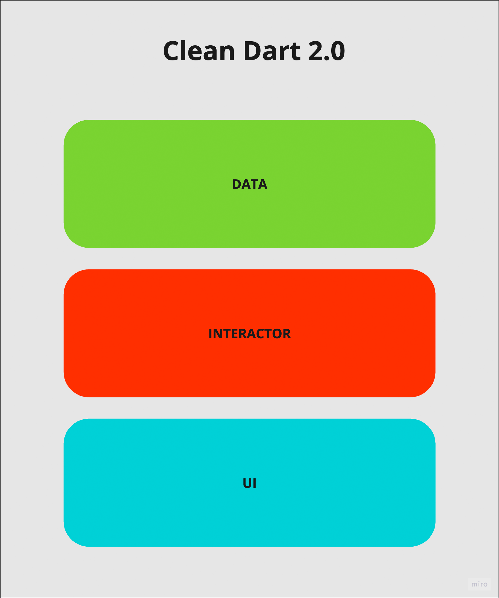

# Clean Dart 2.0
Proposta de Arquitetura Limpa para o Dart/Flutter

## Proposta antiga do Clean Dart 1.0

- [pt-BR](1.0/README.md)
- [en-US](1.0/README_en.md)

# Início

Podemos dizer que uma arquitetura limpa pode definir o futuro do seu projeto, sabendo disso, devemos tê-la como objeto de estudo constante para que assim saibamos onde, quando e como aplicá-la. 

Para essa proposta nos baseamos nas camadas da Arquitetura Limpa proposta por Robert C. Martin no livro **“Arquitetura Limpa: O Guia do Artesão para Estrutura e Design de Software”**.

# Camadas de uma Arquitetura Limpa

**Robert C. Martin** conclui que uma arquitetura deve conter pelo menos 4 camadas principais e independentes para ser considerada “limpa”, são elas: 
1. Regras de Negócio Corporativas
2. Regras de Negócio da Aplicação
3. Adaptadores de Interface
4. Frameworks & Drivers (Externos)

## Regras de Negócio Corporativas

São as regras de negócio cruciais para a sua aplicação. Essa camada tem as regras mais sensíveis de um sistema, por isso ela está no topo das camadas.

## Regras de Negócio da Aplicação

São as regras que só o computador pode executar, aqui temos uma representação de comandos chamados de **"Casos de Uso"**, e basicamente representam as ações que um usuário pode fazer na aplicação. 

## Adaptadores de Interface

Essa camada é responsável por “dar suporte” para as camadas mais altas (Regras de Negócios) convertendo os dados externos em um formato que cumpra os contratos de interface definidos pelas Regras de Negócios.

## Frameworks & Drivers

Todas as abstrações feitas pelas camadas mais altas foram para aumentar a facilidade do plug & play dos artefatos externos como um banco de dados ou uma interface gráfica.

Essa camada normalmente sofre muitas modificações, porém com uma arquitetura limpa aplicada isso pode ser completamente indolor e segura para a sua regra de negócio.

Podemos então trocar uma API REST por outra em GraphQL sem afetar suas regras de negócio. Poderemos também trocar a interface gráfica completamente ou até mesmo trocar o Flutter pelo AngularDart e mesmo assim as Regras de Negócio ficarão funcionais!

Dado as descrições iremos apresentar a proposta de Arquitetura Limpa da Flutterando, a **“Clean Dart”**.

# Clean Dart

Usando o Flutter como exemplo teremos então três camadas mantendo a “Arquitetura de Plugin”, com foco principal no Estado da Aplicação, camada esta que hospeda os eventos/ações para mudança de estado.

A proposta de Arquitetura se propõe a desacoplar as camadas mais externas e preservar a Regra de Negócio.

## UI

A Camada **UI** fica responsável por declarar as entradas, saídas e interações da aplicação. 

Usando o Flutter como exemplo, hospedaremos os Widgets e Pages, já no backend como exemplo, seria nesta camada onde colocaríamos os Handlers ou Commands da nossa API.

## INTERACTOR

A camada de **Interactor** hospedará as Regras de Negócio da aplicação junto aos seus estados.
O núcleo da camada será a elaboração do estado e a prograpação por de alguma abordagem de gerenciamento de estado.

Tomando um Repository como exemplo, teremos que ter apenas o contrato de interfaces(Abstrações) e a responsabilidade de implementação desse objeto deverá ser repassado a outra camada mais baixa.

## DATA

Esta camada dá suporte a camada **Interactor** implementando suas interfaces. Para isso, adapta os dados externos para que possa cumprir os contratos do domínio.

Muito provavelmente nessa camada iremos implementar alguma interface de um Repository ou Services que pode ou não depender de dados externos como uma API ou acesso a algum Hardware como por exemplo Bluetooth. 

Para que o Repository possa processar e adaptar os dados externos devemos criar contratos para esses serviços visando passar a responsabilidade de implementação para a camada mais baixa da nossa arquitetura.

Basicamente a camada **DATA** deve conter tudo aquilo que terá grandes chances de ser alterado sem que o programador possa intervir diretamente no projeto.

# Dicas

## Modularize

Obviamente podemos manter nossas camadas para a aplicação inteira mas podemos ter um melhor proveito criando as camadas Interactor, Data e UI para cada feature. Exemplo:

.
└── src/
    └── features/
        ├── auth/
        │   ├── data
        │   ├── interactor
        │   └── ui
        ├── product/
        │   ├── data
        │   ├── interactor
        │   └── ui
        └── client/
            ├── data
            ├── interactor
            └── ui

## Pense por camada

Quando for desenvolver comece a pensar por camada, não devemos nos preocupar com o que tem na camada de **UI** ou **DATA** no começo da funcionalidade. Se pensarmos nas camadas mais externas podemos acabar nos orientando (erroneamente) por essas camadas. Assim, devemos nos acostumar a desenvolver camada por camada, de dentro para fora e não ao contrário.

Talvez no começo da sua jornada "Limpa" algumas camadas possam parecer "sem utilidade", isso acontece quando nossa mente ainda não está **Pensando em Camadas** (ou porque sua Regra de Negócio é simples demais para isso).

## Teste de Unidade será sua nova UI

É muito comum os desenvolvedores criarem primeiro as suas Views para que então possam "testar" as Regras de Negócio. Mas nós já temos uma ferramenta própria para isso e um lugar dedicado para armazenar esses testes.

Desenvolver de forma "limpa" está em total sinergia com o **TDD**(Test Driven Development) pois a camada de **UI** será uma das últimas coisas que iremos pensar no desenvolvimento da nossa feature.

# Assine!

Apreciamos o seu feedback!
Se concorda com a proposta de Arquitetura Limpa "Clean Dart", deixe uma **Star** neste repositório. Uma **Star** é o mesmo que assinar um "manifesto limpo" concordando com essa proposta.

Estamos abertos a sugestões e melhorias na documentação!
Faça isso por meio das [issues](https://github.com/Flutterando/Clean-Dart/issues), nossa equipe ficará muito contente com seu interesse em melhorar essa ferramenta para a comunidade.

Sinta-se a vontade para abrir um **PR** com correções na documentação dessa proposta.

# Exemplos

- [Clean Dart Burgers Cart using BLoC, Cubit, Triple, Asp, MobX, etc](https://github.com/jacobaraujo7/bloc_atom)
- Clean Dart Login with Firebase, MobX and Modular
- [Clean Dart Github Search with BLoC and Modular](https://github.com/Flutterando/clean-dart-search-bloc)
- [Clean Dart Github Search with MobX and Modular](https://github.com/jacobaraujo7/clean-dart-search-mobx)

# Links úteis

- [Resumo do livro "Arquitetura Limpa"](https://medium.com/@deividchari/desvendando-a-arquitetura-limpa-de-uncle-bob-3e60d9aa9cce)
- [Sua Arquitetura está limpa?](https://medium.com/flutterando/sua-arquitetura-est%C3%A1-limpa-clean-architecture-no-flutter-458c68fad120)
- [Os tijolos do Clean Architecture](https://www.youtube.com/watch?v=C8mpy3pwqQc)
- [The Clean Code Blog](https://blog.cleancoder.com/uncle-bob/2012/08/13/the-clean-architecture.html)

