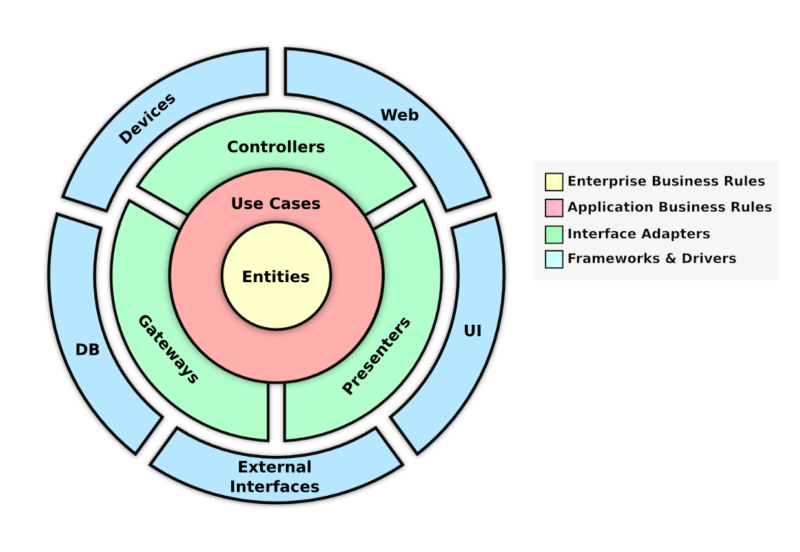
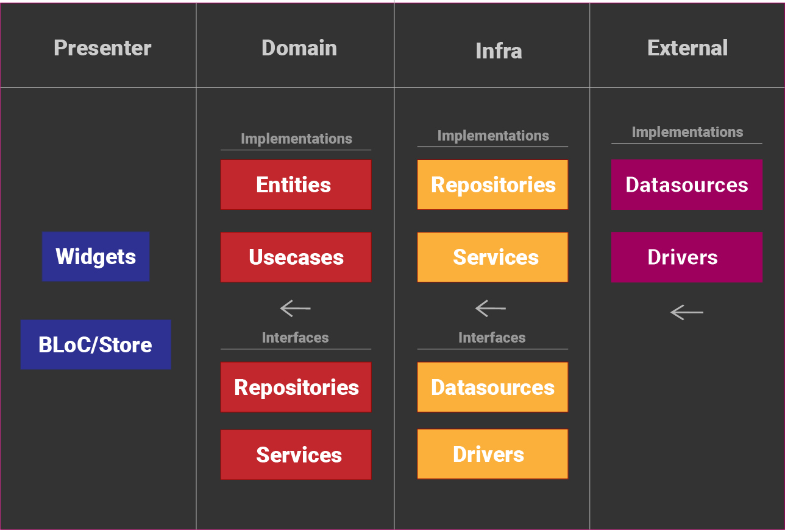
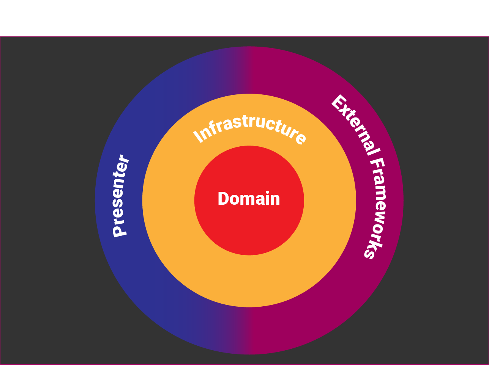

# Clean Dart
Dart/Flutter向けのクリーンアーキテクチャ提案

# Introduction

クリーンアーキテクチャは、プロジェクトの未来を定義すると言えます。そのため、私たちの役割は、それをどこに、いつ、どのように適用するかを知るために、常に勉強することです。

この提案は、Robert C. Martinの **“Clean Architecture: A Craftsman's Guide to Software Structure and Design”** の原則と、そのレイヤー構造アプローチに基づいています。

# Clean Architecture layers

**Robert C. Martin**は、アーキテクチャが「クリーン」であるためには、少なくとも4つの主要かつ独立したレイヤーを持っている必要があると述べています。それらは次のとおりです。

1. Enterprise Business Rules : 企業の就業規則
2. Application Business Rules : コンピュータ上のプログラムの就業規則
3. Interface Adapters : 異なるレイヤーをつなげる適合器
4. Frameworks & Drivers (External) : プログラムの枠組みとOSとDevice間のソフトウェア（外部）

## Enterprise Business Rules : 企業の就業規則

これは、システムの最も感度が高く、最も高いレベルのレイヤーです。これらは、**エンティティ**と呼ばれるデータモデルによって表されます。

エンティティは、純粋でなければなりません。これは、それが下のレイヤーについての知識を持っていないことを意味します。一方、他のすべてのレイヤーは、**エンティティ**について知っています。

## Application Business Rules : コンピュータ上のプログラムの就業規則

これらは、排他的で特定のアプリケーションに固有のルールであり、ターゲットデバイスでのみ実行できます。これらは、**ユースケース** と呼ばれるコマンドで表され、大まかに言えば、ユーザーがアプリケーション内で実行できるアクションを表します。

**ユースケース** は、**エンティティ** レイヤーのみを知っており、下位レイヤーについては何も知りません。

もし **ユースケース** が上位レイヤーにアクセスする必要がある場合、それは [**依存性逆転の原則**](https://ja.wikipedia.org/wiki/%E4%BE%9D%E5%AD%98%E6%80%A7%E9%80%86%E8%BB%A2%E3%81%AE%E5%8E%9F%E5%89%87) を考慮して行われるべきです。

## Interface Adapters : 異なるレイヤーをつなげる適合器

このレイヤーは、上位レイヤーと外部データの間の橋渡しとしての役割を果たします。これは、ビジネスルールで定義されたインターフェース契約を尊重する方法で、外部データが上位レイヤーと通信するのを助けます。

## Frameworks & Drivers (External) : プログラムの枠組みとOSとDevice間のソフトウェア（外部）

全ての上位レイヤーの抽象化は、それらと外部アーティファクトとの間の結合を改善するために特に設計されました。これにより、プラグ＆プレイのスタイルでいつでもそれらを切り替えることが容易になります。

このレイヤーは非常に揮発性が高く、常に変化しています。しかし、クリーンアーキテクチャの中では、これらの変更は完全に痛みなく安全に行うことができ、ビジネスルールは変更されません。

Rest APIからGraphQL APIに、UIから別のUIに、FlutterからAngularDartに切り替えることができます。ビジネスルールは以前と同じように機能し続け、それらを変更する必要はありません。

そうは言っても、具体例がないと理解が難しいかもしれません。そこで、Flutterando Clean Architecture、つまり **Clean Dart** の提案をご紹介します。

# Clean Dart

Flutterを例にとって、4つのレイヤーがあり、メインのフォーカスはアプリケーションドメインにあります。このレイヤーには、2つの主要なビジネスルール、**エンティティ** と **ユースケース** が存在します。

このアーキテクチャは、外部レイヤーを分離し、ビジネスルールを保持することを提案しています。

## Presenter

**プレゼンター** レイヤーは、アプリケーションのI/Oと相互作用を宣言する責任があります。

もし、Flutterを例にとると、このレイヤーには、ウィジェット、ページ、およびステート管理が含まれます。一方、バックエンドを扱う場合、このレイヤーはAPIのハンドラーやコマンドが存在する場所になります。

## Domain

**ドメイン** レイヤーは、**エンティティ** と **ユースケース** を含む **ビジネスルール** を持っています。

**エンティティ** は、データの検証ルールや関数、または `ValueObjects` を通じてデータの検証ルールを持つかもしれませんが、シンプルなオブジェクトである必要があります。**エンティティは、他のレイヤーのオブジェクトに依存してはいけません。**

**ユースケース** は、特定の問題を解決するために必要なロジックを実行しなければなりません。もし **ユースケース** が外部アクセスを必要とする場合、このアクセスは、下位レイヤーによって実装されるインターフェースコンタクトを介して行われるかもしれません。

**ドメイン** は、ビジネスルールの実行のみに責任を持たなければなりません。リポジトリやサービスのような他のオブジェクトの実装を持ってはいけません。

責任を持つ例として、リポジトリを取ると、このリポジトリにはインターフェース契約のみがあります。この契約の実装は、下位レイヤーによって行われなければなりません。

## Infrastructure (Infra)

このレイヤーは、インターフェースを実装することで **ドメイン** レイヤーをサポートします。これを行うために、外部データを適応させ、ドメインの契約を満たす必要があります。

このレイヤーには、おそらく、APIなどの外部データに依存できないリポジトリやサービスインターフェースの実装や、Bluetoothデバイスなどのハードウェアへのアクセスが含まれます。

リポジトリが外部データを処理し適応できるようにするために、これらのサービスのための契約を作成する必要があります。これは、我々のアーキテクチャの下位レイヤーに実装責任を遅延させることを目的としています。

私たちの提案は、外部データにアクセスするために **DataSource** オブジェクトを作成することです。例えば、FirebaseのようなBaaSや、SQLiteベースのローカルキャッシュです。また、アプリケーションとデバイスハードウェアの間の通信をインターフェースするために **Driver** オブジェクトを作成することも提案しています。

データソースとドライバーのような外部アクセスは、別のレイヤーによって実装されなければならず、このレイヤーにはインターフェース契約のみが残ります。

## External

ここでは、ハードウェア、パッケージ、または高度に特定のアクセスに依存する外部アクセスを実装します。

基本的に、**External** レイヤーには、非常に揮発性が高く、常に変化することが期待されるすべてが含まれます。

Flutterにおいて、例えば、ローカルキャッシュには `shared_preferences` を使用します。しかし、プロジェクトの後半になると、`shared_preferences` がアプリケーションの要件を満たすことができなくなり、`hive` のような別のパッケージに置き換えたいと思うかもしれません。この場合、必要なのは、`hive` 固有のロジックを使用して、インフラストラクチャレイヤーが期待する契約の新しいインスタンスを実装するだけです。

他の実用的な例は、Firebase Auth を元としたログインシステムを考える時です。しかしながら、他の認証プロバイダを使用したいと思う別の製品があります。この置換を行うためには、新しいプロバイダに基づいたデータソースを実装し、必要に応じてこの実装を使用するだけです。この代用を行うには、この新しいプロバイダに基づいたデータソースの実装をし、必要な時にFirebaseのものの代わりにこの実装を使用する「依存関係の反転」を行うだけで良くなります。

**データソース** は、外部データを発見し、それをインフラレイヤーに送信することだけに気を配らなければなりません。

これと同様に、**ドライバー** オブジェクトは、契約で必要とされるデバイスハードウェア情報のみを提供し、それ以外のことには関与してはいけません。

# Tips

## Think on layers

開発を始める時、レイヤーについて考えることから始めましょう。例えば、**プレゼンター** や **外部** レイヤーについては心配しないでください。もし外部レイヤーから考え始めると、最終的にはそれに誤解されるかもしれません。したがって、最も内部から最も外部まで、各レイヤーを開発することに慣れるべきです。

あなたの "クリーン" な旅の最初には、これらのレイヤーのいくつかが無駄に見えるかもしれません。これは、私たちの考え方がまだ **レイヤー** に基づいていない場合に起こります (または、おそらく、あなたのビジネスルールがこれに対してあまりにも単純すぎるためかもしれません)。

## Unit Testing is your new UI

なにを始める前にも、アプリケーションのビューを作成することは、開発者にとって非常に一般的で、ビジネスルールをテストするのに役立ちます。しかし、これに対してより適切なツールがすでに存在し、特にこの種のテストに特化した場所があります。

"クリーン" な方法で開発することは、**TDD** (テスト駆動開発) と完全に関連しており、**プレゼンター** レイヤーは、最後に考えて開発するものの1つになります。

## Spent your time dealing with possible errors

**一般的に例外を処理するよりも例外をスローさせる方が良いです...**
良いアプローチは、`dartz` ライブラリの `Either` クラスのようなハンドリング強制アプローチを使用することです。

`Either` クラスは、2つの異なるデータを受け取ることができます。`Left` はエラーを表し、`Right` は実際の期待される結果を表します。これにより、例外を手動で **try-catch** で処理する必要がなくなり、エラーが発生しやすい上位レイヤーでの処理が減ります。

## Don't fall in the temptation of bypassing a layer

時々、とてもシンプルな **ユースケース** があるかもしれません。例えば、これはデータが正しく受信されていることを確認し、CRUD処理を行うためにデータを **リポジトリ** に渡すだけのものです。

データを検証して、別のクラスに送信するだけのメソッドを持つクラスがあることは、奇妙に思えるかもしれませんが、プロジェクトを保守する際に非常に便利であることがわかります。あなたの **ユースケース** がこのように小さく生まれることは珍しくありませんが、近い将来にはより大きく、より複雑になります。

この場合の一つの例としては、Firebaseを使う時です。Firebaseパッケージは単にStreamを返すだけで、あなたは同様にそれを直接あなたの **ビュー** に置くことができます。しかし、いつかFirebaseをプロジェクトから削除して代替手段に置き換える必要がある場合、ビュー全体を作り直すか、プロジェクト全体を作り直す必要があるかもしれません。

つまり、あなたの **コントローラ** から直接 **リポジトリ** を呼び出すこと、またはFirebaseを直接 **ビュー** で使用することに誘惑されないでください。あなたはあなたのアーキテクチャの法則を破り、最終的にはあなたの決定を後悔することになります。

# Sign up!

We would like to have your feedback!

If you like your "Clean Dart" architecture proposal, leave a **star** in this repository. This is the same as signing a "clean manifest" agreeing with our proposal!

We are open to suggestions and improvements on this documentation!
If you want to contribute, open an [issue](https://github.com/Flutterando/Clean-Dart/issues). Our team will be very happy with your interest in improving this tool for the community. Also, feel free to open a **pull request** with fixes to this proposal documentation.

# Examples

- [Clean Dart Login with Firebase, MobX and Modular](https://github.com/jacobaraujo7/login-firebase-clean-dart)
- [Clean Dart Github Search with BLoC and Modular](https://github.com/Flutterando/clean-dart-search-bloc)
- [Clean Dart Github Search with MobX and Modular](https://github.com/jacobaraujo7/clean-dart-search-mobx)
- [Clean Dart Github Search with Flutter Command](https://github.com/aquilarafa/clean_dart_flutter_command)
- [Chat WebSocket with Get_It and Cubit](https://github.com/rodrigorahman/flutter_curso_chat_websocket)
- [Clean Dart Pokedex with BLoC and Modular](https://github.com/umpedetiago/pokedex_with_cleandart.git) 

# Useful links

- [Resumo do livro "Arquitetura Limpa"](https://medium.com/@deividchari/desvendando-a-arquitetura-limpa-de-uncle-bob-3e60d9aa9cce)
- [Sua Arquitetura está limpa?](https://medium.com/flutterando/sua-arquitetura-est%C3%A1-limpa-clean-architecture-no-flutter-458c68fad120)
- [Os tijolos do Clean Architecture](https://www.youtube.com/watch?v=C8mpy3pwqQc)
- [The Clean Code Blog](https://blog.cleancoder.com/uncle-bob/2012/08/13/the-clean-architecture.html)
- [Guilherme's Proposal](https://github.com/guilherme-v/flutter-clean-arch)
